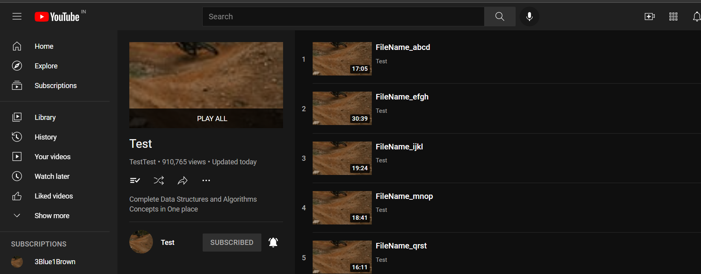
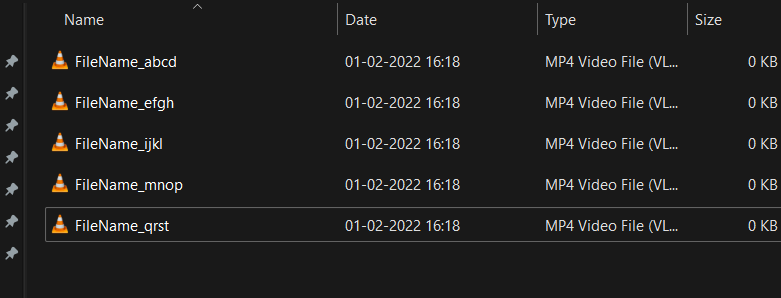
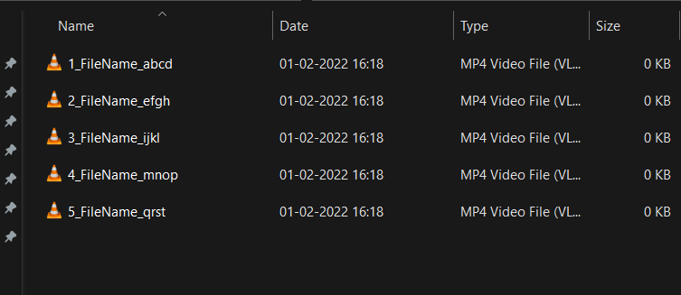

# YT_Downloaded_Video_Sequencer
A simple tool to arrange the downloaded videos from any YouTube playlist into sequence. It works by adding the original sequence number of video to its prefix.

# Currently in Progress. Not working. If anyone wants to help, they are most welcome!
- If you want to test/check the code, I have provided a dummy folder **DownloadedVideos** which contain empty mp4 files having same name as of a youtube playlist whose url is already added in code.

Everything is working fine. But the problem is in find() function in renamer.py.<br/>

***Problem :-*** 
  - How to check if the downloaded file is present in fetched title list(a list containing all the video's title of the playlist in original sequence)? When you download video from Videoder or any other app or website it insert various prefix or suffix or even modify some characters like changing "|" to "_" etc.
  So, it becomes tedious to search the file in fetched title list to get the sequential index.
  
***Proposed Solution :-***
  - I am thinking of partially checking the similarity by using startswith() or endswith() function instead of checking entire title string. It will solve the problem of extra suffix or prefix that were not in original title but added by app or website through which you have downloaded the video.

## Requirements :-

- Python3 
- Selenium
- Chromedriver

## How to install Requirements :-

1. Python3 can be installed from their official site https://www.python.org/ . Or you can use anaconda environment.
2. Selenium for Python can be installed by following command :-
```
python3 -m pip install selenium
```
3. I have already provided Chromedriver (version: 97.0.4692.71) .exe file But if you want to install anyways, do this from their official site :-
  <a href="https://chromedriver.chromium.org/downloads" target="_blank">Download Chromedriver</a><br/>
  Place the .exe file of chromedriver in the same folder where renamer.py file is located.

## Getting Started :-

- Download or clone repository.

- Open cmd or terminal in same directory where **renamer.py** file is stored and then run it by followng command :- 
```
python3 renamer.py
```

## Expected Output :- 

  - Playlist from where videos are downloaded.<br>
    <br>  


  - After downloading videos are stored without any order or sequence.<br>
    <br>  
 
 
  - After running **renamer.py**, all files are renamed sequentially.<br>
      

  

## Dev :- Prakash Gupta
